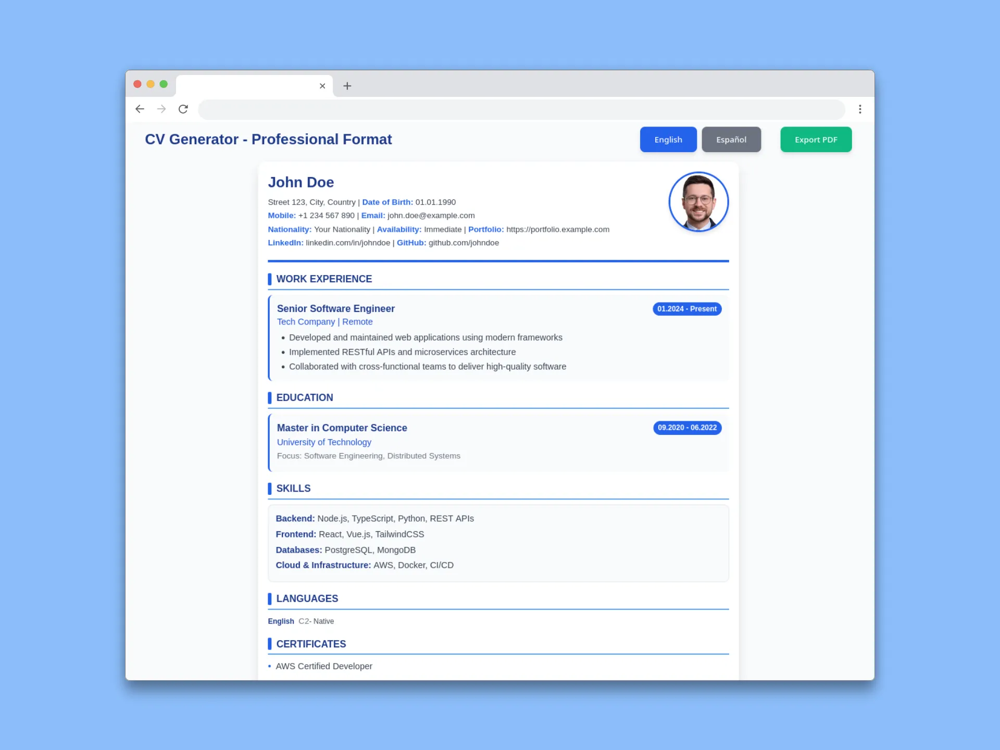

# CV Generator - Professional Format

<div align="center">


**A modern, AI-friendly CV generator designed for the era of intelligent development**

</div>

---

<div align="center">



</div>

## 🚀 About This Project

This CV Generator was developed with a modern philosophy: **leverage AI from your IDE to adapt content and format, automating the CV update process** instead of being trapped in rigid, fixed CV templates.

In today's fast-paced tech landscape, your CV needs to evolve continuously. Traditional CV builders lock you into predefined formats, making updates tedious and limiting your ability to showcase your unique professional journey. This project takes a different approach:

- **AI-Native Architecture**: Built specifically to work seamlessly with AI coding assistants (like Cascade, Cursor, GitHub Copilot, etc.)
- **JSON-Based Content**: Your CV data lives in structured JSON files that AI agents can easily read, understand, and modify
- **Component-First Design**: Modular Vue components that can be reorganized, enhanced, or replaced by AI
- **No Template Lock-In**: Adapt the structure, add new sections, or completely redesign the layout without constraints
- **Real-Time Iteration**: See changes instantly as you or your AI assistant updates the data

### Why This Matters

Instead of manually wrestling with visual editors or being limited by template choices, you can now:
- Ask your AI assistant to "highlight my recent cloud experience" and watch it restructure your experience section
- Request "add a certifications section" and have AI create the component and data structure automatically
- Say "tailor this CV for a frontend role" and let AI emphasize relevant skills and projects
- Maintain multiple language versions (English/Spanish) with synchronized updates

This is the future of professional documentation: **your CV as code, AI as your co-author**.

---

A modern, bilingual CV generator application built with Vue 3 and Vite. This application allows users to create, preview, and export professional CVs in English and Spanish with PDF export capabilities.

## Features

- **Bilingual Support**: Switch between English and Spanish CVs
- **Real-time Preview**: Live preview of CV changes
- **PDF Export**: Export CVs to PDF using Gotenberg
- **Professional Layout**: Clean, professional CV formatting
- **Customizable Data**: JSON-based CV data for easy editing
- **Responsive Design**: Works on desktop and mobile devices

## Tech Stack

- **Framework**: Vue 3 with Composition API and `<script setup>`
- **Build Tool**: Vite with Rolldown
- **Styling**: Custom CSS with scoped styles
- **PDF Generation**: Gotenberg (Docker-based)
- **Package Manager**: Bun

## Prerequisites

- Node.js >= 18.0.0
- Bun (recommended) or npm/yarn
- Docker (for PDF export functionality)

## Installation

1. Clone the repository:
```bash
git clone <repository-url>
cd app
```

2. Install dependencies:
```bash
bun install
```

3. Start the development server:
```bash
bun dev
```

The application will be available at `http://localhost:5173/`

## PDF Export Setup

To enable PDF export functionality, you need to run the Gotenberg Docker container:

1. Start the Gotenberg service:
```bash
docker-compose up -d
```

2. The Gotenberg service will be available at `http://localhost:7777`

3. Restart the Vite dev server after starting Gotenberg

## Project Structure

```
app/
├── src/
│   ├── components/       # Vue components
│   │   ├── CVHeader.vue      # CV header section
│   │   ├── CVSection.vue     # Reusable section component
│   │   ├── CVSkills.vue      # Skills display component
│   │   ├── CVAdditional.vue  # Certificates and additional info
│   │   └── CVFooter.vue      # CV footer
│   ├── data/            # CV data files (mock data)
│   │   ├── cvDataEnglish.json
│   │   └── cvDataSpanish.json
│   ├── utils/           # Utility functions
│   │   └── gotenberg-generator.ts
│   ├── assets/          # Static assets
│   ├── App.vue          # Main application component
│   └── main.js          # Application entry point
├── public/              # Public assets
└── package.json
```

## Usage

### Editing CV Data

1. Edit the JSON files in `src/data/`:
   - `cvDataEnglish.json` for English CV
   - `cvDataSpanish.json` for Spanish CV

2. The changes will be reflected in real-time in the preview

### Switching Languages

Click the language buttons in the header to switch between English and Spanish versions.

### Exporting to PDF

1. Ensure Gotenberg Docker container is running
2. Click the "Export PDF" button
3. The PDF will be downloaded with the filename format:
   `CV-{LANG}-{NAME}-{TITLE}-{DATE}.pdf`

## Data Structure

The CV data follows this structure:

```json
{
  "personalInfo": {
    "name": "Full Name",
    "email": "email@example.com",
    "phone": "+1 234 567 890",
    "location": "City, Country"
  },
  "experience": [
    {
      "period": "01.2024 - Present",
      "title": "Job Title",
      "company": "Company Name",
      "description": ["Responsibility 1", "Responsibility 2"]
    }
  ],
  "education": [
    {
      "period": "09.2020 - 06.2022",
      "degree": "Degree Name",
      "institution": "University Name",
      "description": "Focus area"
    }
  ],
  "skills": {
    "technical": {
      "Backend": "Skill1, Skill2",
      "Frontend": "Skill1, Skill2"
    },
    "languages": [
      { "name": "Language", "level": "Level", "description": "Description" }
    ]
  },
  "certificates": ["Certificate 1", "Certificate 2"],
  "additional": ["Additional info 1", "Additional info 2"],
  "projects": [
    {
      "name": "Project Name",
      "description": ["Description 1", "Description 2"]
    }
  ]
}
```

## Development

### Available Scripts

- `bun dev` - Start development server
- `bun build` - Build for production
- `bun preview` - Preview production build

### Adding New Components

1. Create a new Vue component in `src/components/`
2. Import and use it in `App.vue` or parent components
3. Follow the existing naming convention: `CV*.vue`

### Styling

- All styles are scoped to components
- Main styles are in `src/index.css` and `src/style.css`
- Use CSS custom properties for consistent theming

## Docker Services

The application uses Docker for PDF generation:

```yaml
services:
  gotenberg:
    image: gotenberg/gotenberg:8.30.1
    ports:
      - "7777:3000"
```

## Privacy

The CV data in `src/data/` contains mock/example data committed to the repository for demonstration purposes. Replace with your personal information for actual use.

## License

MIT License - see [LICENSE](./LICENSE) file for details
